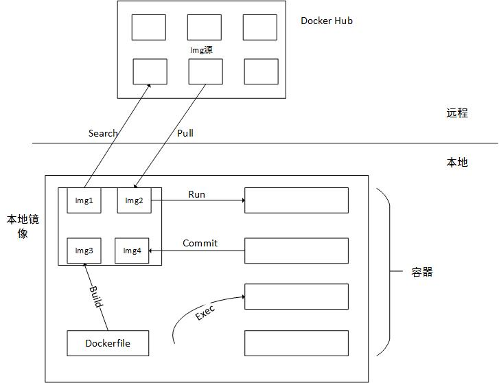

## Docker使用方法
> 本节重点讲一下Docker是怎么使用的，介绍一些最基本的常见的命令
<!--more-->

Docker类似于虚拟机，但相对于虚拟机其具有两大显著特点：更加轻量级，比虚拟机启动跟快；一个宿主机上所能容纳的docker更多。

通过docker search命令搜索可用镜像，docker pull从远程Hub上下载镜像到本机上，docker run可以将镜像运行到容器，docker exec进入容器。容器内部和Linux虚拟机类似，经过修改过的容器，可以通过docker commit修改镜像保存，下次重新加载此镜像就是经过修改后的结果。另外一种制作镜像的方法是通过Dockerfile，通过特定的语法规则定义。

## docker内部原理

> Dockre是通过go语言实现的容器，熟悉Docker用法之后，下一步就是学习Docker内部是如何实现的，这个以后有时间再慢慢学习

---
