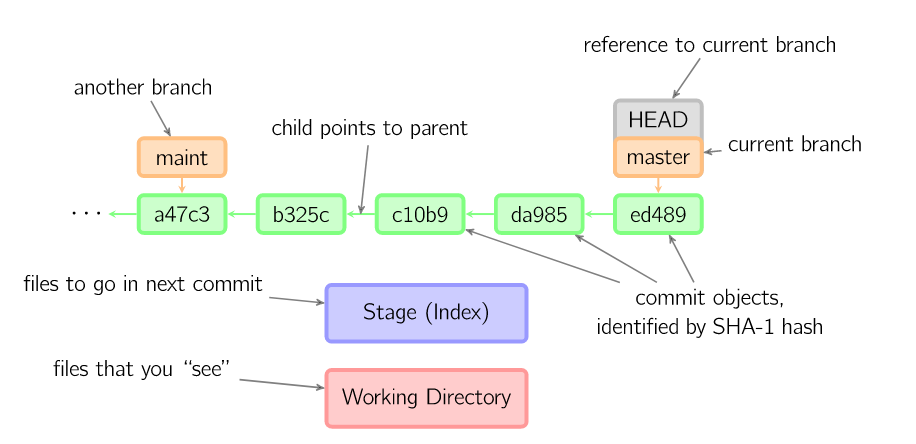
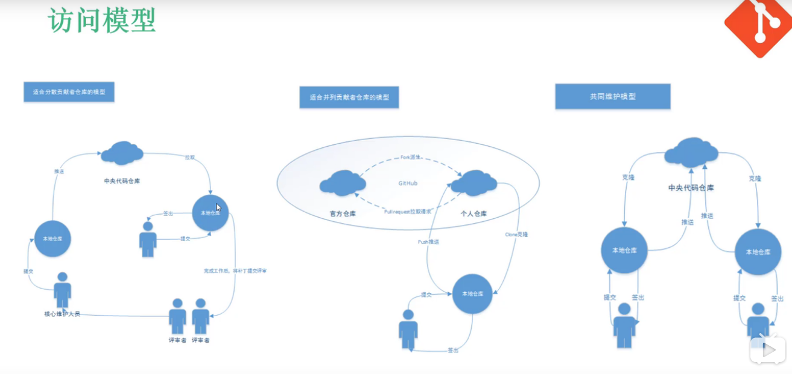
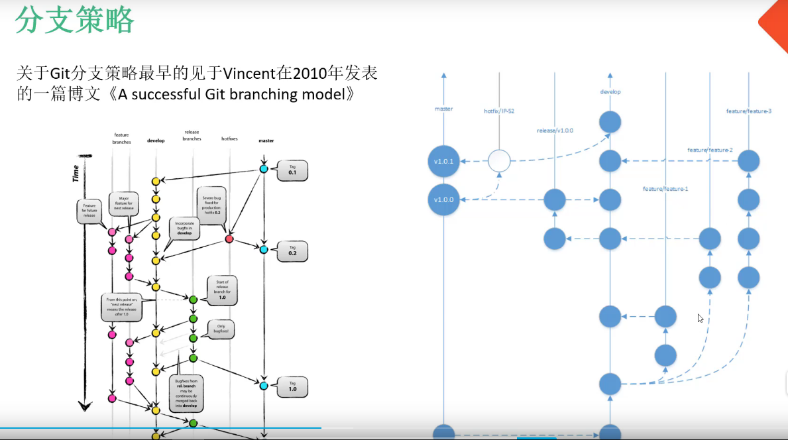

## Git常用基本功能
git init, git add 和git commit 都是前期的准备, 相当于将你本地的文件都上传到了本地仓库，但是还没有像远端仓库提交；
<!--more-->
```
git init //初始化一个git的本地仓库
git add README.md //将我的文件装上武器，准备发射
git commit -m “first commit” //第一次发射，我的README.md 宝贝已经成功进入到本地仓库
git remote add Ceres your_first_git_address //将第一个git address命名为Ceres
git push -u Ceres master //注意咯，我要向远端木星发射了，太远了，一定要用push，很费劲的赶脚
 
 
//这时，不要动，准备再次将我的README宝贝发射到火星上去，
//但是因为我的文件已经存在与本地仓库了，因此我就不需要再多余地commit等，
//只需要将另一个远端仓库与本地仓库建立一个连接就可以了
git remote add Mars your_second_git_address //将第二个git address命名为Mars
git push -u Mars master //再次发射，目标火星上的master分支
```
至此，就将一份代码上传到了两个远端仓库，但是注意你仍然时只有一个本地仓库哦

## Git本地化操作

> Git本地化操作就是解决Working Directory、Stage、Local Repository三者之间的各种版本回退问题

参考文章：[图解git](http://marklodato.github.io/visual-git-guide/index-zh-cn.html)




Git 的本地化操作主要集中在以下几个命令，每个命令都有一个常见的语法，细则的话则有很多，实际使用时查阅手册即可：
+ git add
+ git commit
+ git reset
+ git checkout
+ git diff
+ git status
+ git log

## Git 分支

+ git branch:新建分支
+ git checkout :切换分支
+ git switch
+ git merge
+ git rebase:另外一种合并方式

## Git 远程操作

### 常见命令：

+ git bare:自建使用SSH协议的Git仓库，通过git remote add命令即可添加
+ git push
+ git fetch
+ git merge
+ git pull=(git fetch+ git merge)

### Git更新远程仓库代码到本地

> 当我们在多台电脑上或者多人共同开发一个项目的时候，远程仓库会不时地被修改，而自己也在不断修改自己的本地仓库，因此仓库的远程版本与本地版本势必会导致不一致

[参考文章](https://www.cnblogs.com/sxy370921/p/11734612.html)

1. 方法一：本地master分支更新至远程主机的master分支

```
git remote -v  //查看远程仓库
git fetch origin master:tmp   //拉取远程origin的master分支到本地tmp分支
git diff //比较本地master分支和tmp分支
git merge temp   //合并本地master分支和tmp分支
git branch -d tmp //删除临时的tmp分支
```

2. 方法二：拉取远程dev分支与本地dev分支合并

```
git pull origin dev:dev
```

> git pull <远程仓库名> <远程分支名>:<本地分支名>

> git pull <远程仓库名> <远程分支名>     没有本地分支时，默认是当前分支

> git pull <远程仓库名>      上述命令进一步简化成：当前分支关联的远程分支


上述命令等同于

```
git fetch origin dev
git checkout dev
git merge origin/dev
```

## Git团队协作

> 有以下三种常见的团队协作方式



+ 方案一

> 代码只能由核心开发人员提交，Linux系统开发运作模式

+ 方案二

> 从远程仓库复制一份到自己的GitHub，然后git clone到本地仓库，git push后通过pull request向远程仓库请求。该方法可以对提交的代码进行review，提出宝贵意见，经过创始人审核同意后方可加入代码库。

+ 方案三

> 该方案适合小团队并行开发，云端维护master、dev分支，master分支是稳定的发布版本，经过测试完美通过的代码才能合并到该分支。每个开发人员克隆devg分支到本地后，开发各自的feature/feature1分支，经过自测成功后的代码合并到dev分支。然后创建release分支进行多功能联合测试，测试通过后同步到master和dev分支，并在master分支加入tag。如果在master分支出现bug，创建hotfix分支，修改bug后通过到master分支和dev分支。

[A successful Git branching model](https://nvie.com/posts/a-successful-git-branching-model/)


## Reference

<https://blog.csdn.net/qq_25458977/article/details/87875641>
[廖雪峰博客](https://www.liaoxuefeng.com/wiki/896043488029600/897271968352576)
<https://github.com/521xueweihan/git-tips>
[git - 简明指南](http://rogerdudler.github.io/git-guide/index.zh.html)
[图解git](http://marklodato.github.io/visual-git-guide/index-zh-cn.html)

---
