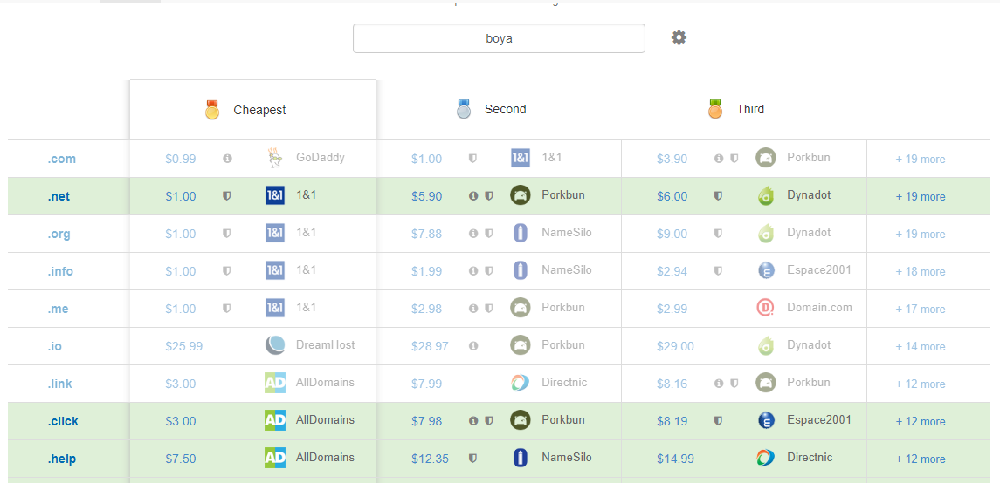
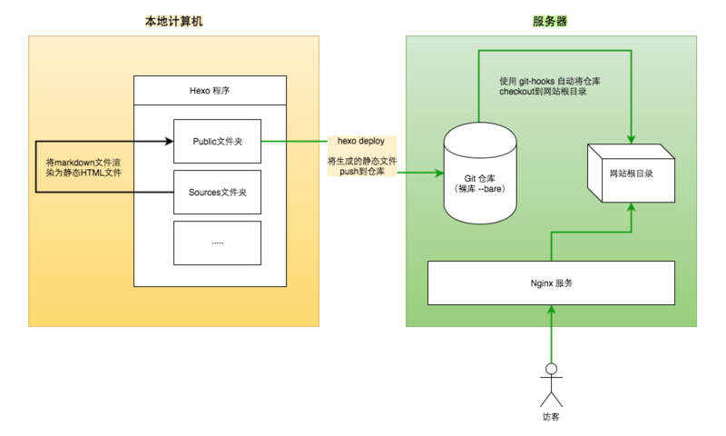
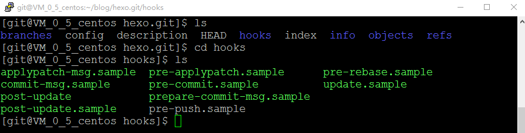
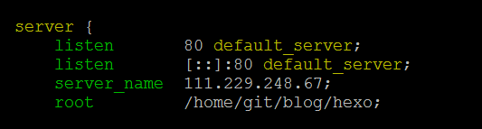

> 摘要：本文主要介绍Hexo博客的安装和部署流程，`安装`章节包括依赖环境的install和Hexo的基本命令;`部署`章节包括GitHub和vps的部署。此外还介绍服务器和域名的购买流程。
<!--more-->
---
# Hexo 安装（本地）

## 基本配置环境

+ Git 安装
+ Node.js安装
+ Hexo安装
```bash
$ npm install -g cnpm --registry=https://registry.npm.taobao.org #切换淘宝镜像
$ cnpm install hexo-cli -g #安装hexo
```

## Hexo基本命令
+ 初始化站点
```bash
$ hexo init
```
+ 新建博文
``` bash
$ hexo new "My New Post"
```
More info: [Writing](https://hexo.io/docs/writing.html)

+ 清空本地静态文件
```bash
$ hexo clean
```
+ 生成静态文件
``` bash
$ hexo generate
```
More info: [Generating](https://hexo.io/docs/generating.html)
+ 启动本地服务器
``` bash
$ hexo server
```
More info: [Server](https://hexo.io/docs/server.html)
+ 部署到远程网站
``` bash
$ cnpm install hexo-deployer-git --save #安装deployer包
$ hexo deploy #部署到GitHub
```
More info: [Deployment](https://hexo.io/docs/one-command-deployment.html)

# 博客的远程部署(自建VPS服务器)

> Github服务器在国外，主要的优点是免费，但是在国内访问的速度很慢，尤其在手机端更甚，因此需要把Hexo生成的静态网页部署到国内的服务器上。一种简单的方法是把代码部署到Coding网站，但是经过测试依然很慢，于是就在腾讯云购买了服务器和域名，把代码发布到自己的VPS服务器上。

## 服务器购买

新型冠状病毒肆虐期间，腾讯云搞大促互动，遂购买腾讯云一年的服务器。其基本配置是：内存2GB，硬盘50GB，99元/年，价钱可以说是非常良心了。购买的过程比较简单，就跟在淘宝上买东西一样，简单操作一下就好。

[腾讯云服务器用户手册](https://cloud.tencent.com/document/product/213)

## 域名购买

1. 域名查询及购买
+ 国内云厂商

可以在阿里云、腾讯云、华为云购买域名，大多云厂商均提供域名购买代理功能。
[阿里云万网域名查询](https://wanwang.aliyun.com/?spm=5176.12825654.eofdhaal5.9.3dbd2c4a743gNQ&aly_as=yHftQl5i)
[腾讯云域名查询](https://dnspod.cloud.tencent.com/)
[腾讯云域名查询](https://www.huaweicloud.com/product/domain.html)
国内的几家价钱都差不多，第一年可以略有差别，三年和五年的域名购买价钱基本相当。

+ 国外

国外的相对来说域名便宜一点
一个可以查询国外各个厂家域名价格，并给出最便宜建议的网站<https://www.domcomp.com/>

GoDaddy：
1&1：这两家貌似很便宜
namecheap：<https://www.namecheap.com/>

因为我的服务器是在腾讯云买的，域名国内的话价钱都差不多，为了方便后边的各项配置，于是在腾讯云购买了域名boya.wiki

2. 域名基本配置
购买了域名之后大概要干以下几件事：
+ 配置DNS服务器
+ 将域名映射到ip地址，dns解析一般有两种方式：A和CNAME。A方式就是将域名映射到某个ip，CNAME方式将域名映射到另外一个域名。
+ 实名认证：按照腾讯云给出的提示一步一步操作

3. 域名备案
+ ICP备案
备案和实名认证是两个东西(之前一直认为是一个东西……)，备案的话首先需要用户提交材料，上传到腾讯云审核，然后上传国家相关机构审核。这个就和申请专利类似，腾讯其实是一个代理的作用，如果个体提交的信息有误，腾讯云的客服会帮助个体进行相关信息的修改，以达到快速实现域名的备案。一般实名认证3天后可以开始申请域名备案(个人信息上传到国家系统有延迟)，个体提交备案材料1天后腾讯云即审核通过，如果没有问题的话，一周之内国家也会审核通过的。
+ 公安备案
ICP备案成功后访问域名即可以解析到对应的ip地址，最后还需要公安部备案。

## 🌟远程部署 

> 通常我们把文件上传到GitHub上，默认的repository存储在GitHub提供的免费服务器上。利用SSH协议，我们可以在自建VPS服务器上自建git仓库，实现代码的自动部署。

有三种方法可以实现服务器端的部署
方法一：在服务器端重新实现一遍本地部署的方法，安装git、nodejs、hexo

方法二：本地部署到GitHub，然后再服务器端`git clone`或者`git pull`

方法三：在服务器端自建repository，本地与服务器端通过SSH直接通信

Hexo个人博客的远程部署原理如下图所示，本地Markdown文件经过渲染后生成html静态文件(一般无数据库后端)，传统的发布到GitHub，本质就是将这些html文件传输到GitHub的远程仓库xxx.github.io。远程部署需要在vps服务器创建git仓库(git bare仓库)，然后利用git-hooks工具自动将git仓库中的代码拷贝到网站的根目录;client访问Hexo博客时通过nginx服务器监听80端口，展示网站根目录的index.html，从而开启网站浏览。

    经过本地发布(localhost:4000)和Github发布(xxx.github.io)成功后，将Hexo博客部署到腾讯云VPS上，具体步骤如下：
1. 安装git并配置SSH
>Tips：安装Git、新建git用户、SSH免密
+ 安装git
```bash
yum update -y #更新yum
yum install git # 安装git
git --version #查看git版本

```
+ 创建git用户
```bash
adduser git
chmod 740 /etc/sudoers //写权限
vim /etc/sudoers
```
+ 打开sudoers修改git用户的权限(在原始文件中添加一行)
```bash sudoers
root    ALL=(ALL)     ALL
+ git    ALL=(ALL)     ALL
```

+ 给git用户添加密码
```bash
sudo passwd git
```
+ 生成一对ssh认证密钥(防止一直输入密码)
```bash
su git
cd /home/git
mkdir /blog/.ssh
cd blog/.ssh
ssh-keygen -t rsa
```
+ 以下在本地端操作
```bash
ssh-keygen -t rsa
```

+ 将本地生成的ssh-keygen上传到远程服务器，这样就不要每次都要输出密码
```bash
ssh-copy-id -i C:/Users/Administrator/.ssh/id_rsa.pub git@111.229.248.67
```

+ 测试ssh远程登录是否成功，必须免密才算成功
```bash
ssh git@111.229.248.67
```
---
2. 自建Git Bare仓库并利用钩子(hooks)拷贝到网站根目录

+ 自建Git裸仓库(Bare)
```bash
mkdir -p /home/git/blog/hexo.git #准备成为Git仓库
mkdir /home/git/blog/hexo #存储网站文件（文章啦渲染之类的）
git init --bare /home/git/blog/hexo.git #设为git仓库，--bare代表这是裸库，裸库没有工作区，我们不会在裸库上进行操作，它只为共享而存在
```
> 裸仓库与 git init 初使化的仓库不太一样，裸仓库其实相当于通过克隆来的仓库里的.git文件夹，整个裸仓库中只有git索引（index），不包含工作目录。

+ 创建钩子Hooks
将目录切换至 /home/git/blog/hexo.git/hooks，用 cp post-update.sample post-update 复制并重命名文件后,vim post-update 修改，增加执行脚本:
```bash
cd /home/git/blog/hexo.git/hooks //进入该仓库
cp post-update.sample post-update
vim post-update
```

post-update文件中原来有一行脚本，此时需要删除(这个坑卡了好久)

```bash post-update
#!/bin/sh

-- exec git update-server-info

++ DIR=/home/git/blog/hexo

++ git --work-tree=${DIR} clean -fd

++ git --work-tree=${DIR} checkout --force
```
> Git 钩子存在于每个 Git 仓库的 .git/hooks 目录中。 当你用 git init 初始化一个新版本库时，Git 默认会在这个目录中放置一些示例脚本。所有的示例都是 shell 脚本，其中一些还混杂了 Perl 代码，不过，任何正确命名的可执行脚本都可以正常使用 —— 你可以用 Ruby 或 Python，或其它语言编写它们。
> .sample拓展名是为了防止它们默认被执行，安装一个钩子只需要去掉.sample拓展名即可。

赋予可执行权限

```bash 
chmod +x post-update
```
---
3. 安装nginx并配置服务器信息

```bash 
yum install nginx
vim /etc/nginx/nginx.conf
```
配置文件nginx.conf中，第一行的user 要改成root,server_name改成服务器ip地址或者域名,root改成hexo网站文件存储路径


在/home/git/blog/hexo新建index.html(网站首页),加入如下代码：
```html index.html
<!DOCTYPE html>
<html>
  <head>
    <title></title>
    <meta charset="UTF-8">
  </head>
  <body>
    <p>Nginx running</p>
  </body>
</html>
```

访问服务器 IP 或者域名显示`Nginx running`,则说明nginx配置成功


4. 本地配置_config.yml
+ 打开站点配置文件_config.yml,配置deployer仓库信息
```markdown _config.yml
 repo: 
    vps: git@111.229.248.67:/home/git/blog/hexo.git 
    github: https://github.com/MasterXuBoya/masterxuboya.github.io.git
```
>git表示远程主机的用户名，`111.229.248.67`是服务器ip，`/home/git/blog/hexo.git` 是远程主机的仓库。
>注意：此处不要写成/home/git/blog/hexo，该目录是网站根目录，是.git仓库中的内容经过hooks自动生成的
+ 发布
```bash
hexo clean && hexo g && hexo s
```
此时代码自动部署到GitHub和vps服务器的`/home/git/blog/hexo.git`目录
>如果此时通过putty工具访问vps，`cd`到`/home/git/blog/hexo.git`目录，发现并没有上传的文件，其实只是git类型的文件不显示而已。如果在本地执行`git clone /home/git/blog/hexo.git`，是可以看到生成的文件的。
打开/home/git/blog/hexo，发现静态网页已经同步到该目录，启动nginx即可通过ip远程访问，至此完成网站的远程自动部署。

## 服务器端常见命令

网站根目录：/home/git/blog/hexo
git仓库：/home/git/blog/hexo.git

查看端口进程：`netstat -ntlp`
查看nginx进程：`ps -ef|grep nginx`

测试nginx.conf文件配置是否正确:`nginx -t`

> 查找到nginx对应的pid之后，可以重启nginx服务器，有以下两种方式：
重启nginx：`kill -HUP pid`
重启nginx:`nginx -s reload`

# 参考网址
<https://blog.csdn.net/jiachunchun/article/details/90235492>
<https://blog.csdn.net/weixin_34413802/article/details/88986540>
[用 Git 钩子进行简单自动部署](https://aotu.io/notes/2017/04/10/githooks/)
[git钩子 hook post-receive](https://blog.csdn.net/ttaohua/article/details/102984045)

---
