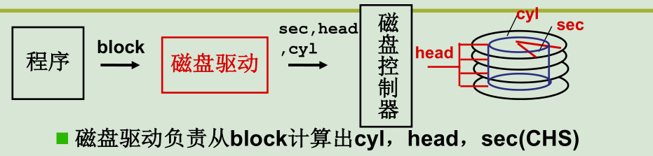
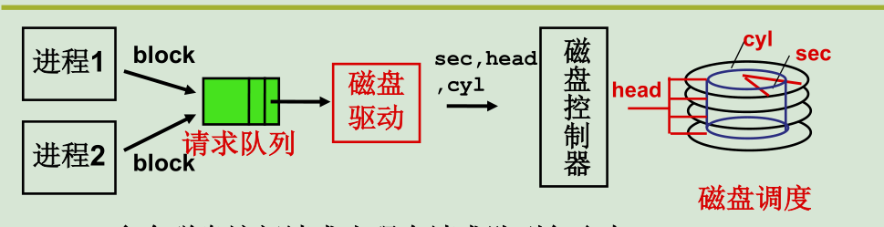
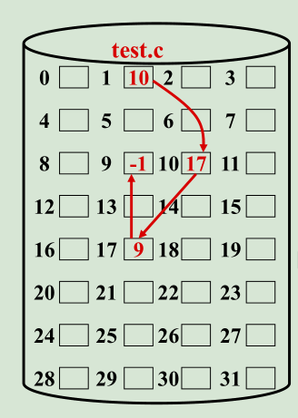
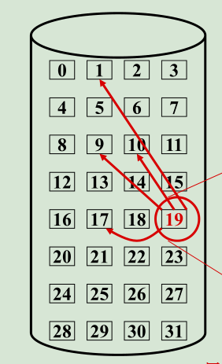
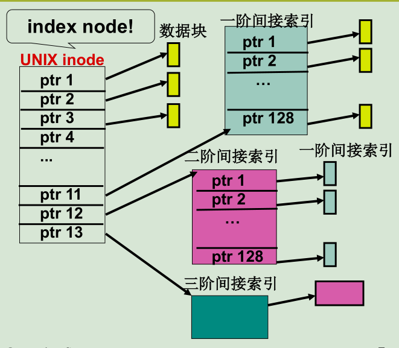
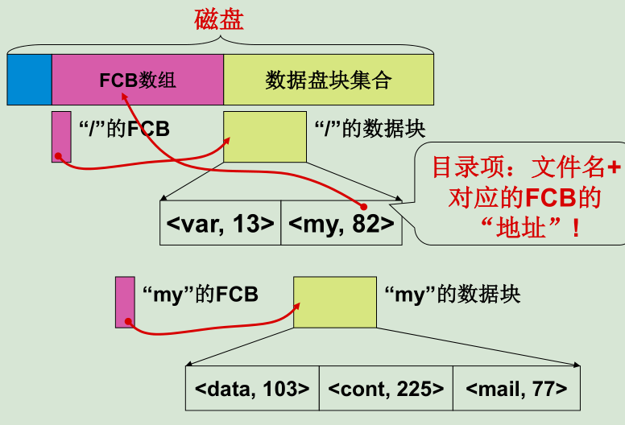
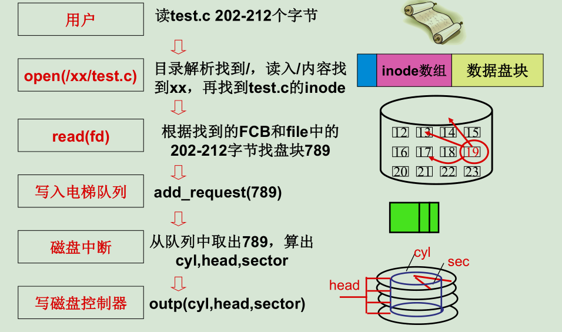

## 进程与线程

<!--more-->

## 内存管理


## I/O设备管理


## 磁盘管理

> 磁盘的五层抽象

### 第一层抽象：block-->CHS

​		磁盘I/O的时间主要浪费在寻道上，而用户时间在工作时，通常需要访问block连续的区间，因此对磁盘编码的主要工作着眼点就是尽量降低寻道时间。磁盘有三个维度，也就是说存在多种编码方式，最优的编码方式按照如下顺序依次编码：

+ 磁道：对扇区编码时，1号扇区在0号扇区的同一磁道，旋转磁盘，直至同一磁道填满；
+ 柱面：然后对同一个柱面的不同磁道编码，和上面类似的过程；
+ 磁头：移动磁头到不同的柱面，重复上述两个过程。

block= C × (Heads× Sectors) + H× Sectors + S

​		通常block包含多个扇区，block是逻辑的磁盘块，而扇区是物理的磁盘块。block是上层应用所能访问的最小磁盘块，block越大读取的速度也就越大，但是空间利用率就会有所下降；反之亦然。



### 第二层抽象 ：多个block并发



> 磁盘只要一个，但是会存在多个进程访问磁盘，因此需要建立队列。

+ 最简单的调度方式就是采用FIFO
+ SSTF 磁盘调度：该方法每次访问离当前位置最近的磁盘块。由于实际系统的磁盘调用大多集中在中部位置，因此两遍的磁盘块可能存在”饥饿现象“，进入队列很久都无法访问。
+ SCAN 磁盘调度：从当前位置一直向左，再一直向右，再一直向左……
+ 电梯调度算法：每次从最后边向左访问，然后复位到最后侧（该操作速度很快），重新从最大的位置往左依次访问。

### 第三层抽象File：inode-->block

> ​		一个文件在磁盘中会分布到多个block，每一个文件存在一个FCB（文件描述符）， 该结构记录了文件的逻辑块与物理block之间的映射关系。

+ 顺序存储方式

  文件的多个block在磁盘上是依次存储的，该方式不适合数据文件的动态变化；

+ 链式存储方式

  链式存储方式在每次block记录下一个block存储的位置。最大的确实是无法“定位”，访问第10个block必须依次访问前9个



+ 索引存储方式

  索引存储方式类似map，也就是我们通常思维的实现方式，将逻辑的块与物理的block映射起来



+ 多级索引



​		多级索引的结构如上图所示，该struct其实是记录在inode结构，也就是在FCB中。inode->i_zone前7个通过直接索引得到。inode->i_zone[7]指向的**block块**是一个索引结构，该block块建立了逻辑块与索引块的映射关系。进一步地，还有二级索引、三级索引。

```c
int _bmap(m_inode *inode, int block, int create)
    { if(block<7){ if(create&&!inode->i_zone[block])
    { inode->i_zone[block]=new_block(inode->i_dev);
    inode->i_ctime=CURRENT_TIME; inode->i_dirt=1;}
    return inode->i_zone[block];}
    block-=7; if(block<512){
    bh=bread(inode->i_dev,inode->i_zone[7]);
    return (bh->b_data)[block];} ...
```


### 第四层抽象目录:path-->inode

>  如何通过/my/data/a这个目录得到文件的inode是本层抽象所要解决的问题

​		所有文件、目录的FCB统一放在磁盘的某一段连续空间，并按顺序编号。我们平时C语言`open`函数得到的`fd`其实就是FCB数组的index，利用FCB[fd]就可以得到该文件的inode信息，进而访问该文件的数据。

​		根目录`/`默认在FCB数组的起始位置，按照文件的目录结构依次解析。首先访问`/`获取根目录的inode，此时可以读取根目录的`data`，根目录的数据内容就是<var,13><my,82>这种信息。读取根目录的内容就可以得到my所在的fd，进而可以访问FCB数组的82号位置，得到`my`的inode，进而读取my的数据内容。不断重复上述过程，直至解析到叶子文件。此时就可以调用file的操作了。



​		为了实现磁盘的自动检测，所有磁盘的配置信息、基本参数还是存在磁盘中。总体来看，磁盘首先是引导块（一般占据一个block），然后是超级快（super），超级快存储了接下来两个块的长度，有了这两块的长度，程序就可以 快速定位根目录`/`所在的FCB块。


### 总结

