---

## 引言

### 数据库基本概念

数据库系统包括以下内容

<!--more-->

+ 数据库—表：相互有关联的数据的集合
+ 数据库管理系统DBMS（MySQL、DB2、Oracle等）
  + 从用户角度（用户使用角度）：
    + 数据定义语言DDL
    + 数据操纵语言DML
    + 数据控制语言DCL
    + 嵌入式数据库语言(Java调用SQL)
  + 从系统角度（系统实现角度）
    + 语言编译器
    + 查询优化与实现
    + 存储与索引
    + 通信控制：分布式数据库
    + 事务机制
    + 故障恢复
    + 安全性控制
    + 完整性控制
    + 数据库性能分析
    + 各种控制程序
+ 数据库应用程序：图书订阅系统、学生成绩管理系统等业务系统
+ 数据库管理员DBA

### 课程内容概览

该MOOC课程主要分成以下四个部分：

+ 关系模型理论：基本的关系模型理论
+ 数据库语言SQL：介绍SQL的DDL和DML语言
+ 数据建模与数据库设计：介绍范式理论，数据建模方法，如何建表
+ 数据库管理系统的实现技术：介绍如何实现数据库管理系统

## 关系模型理论

#### 基本概念

##### 三级模式两层映像

0. 三级模式

+ External Level = User Level

某一用户能够看到和处理的数据，全局数据中的某一部分

+ Conceptual Level=Logic Level

从全局角度理解/管理的数据，含有相应的约束

+ Internal Level=Physical Level

存储在介质上的数据，含存储路径、存储方式、索引方式等

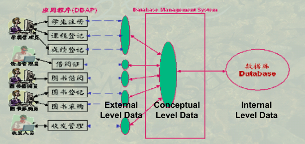

1. 两层映像

+ E-C Mapping

将外模式映射为概念模式，从而支持实现数据概念视图想外部视图的转换，便于用户观察和使用

+ C-I Mapping

将概念模式映射为内模式，从而实现数据概念视图想内部视图的转换，便于计算机进行存储和处理

2. 两个独立性

+ 概念数据独立性

当概念模式发生改变时，可以不改变外模式，只要改变(E-C Mapping)，从而无需改变应用程序

+ 物理数据独立性

当内部模式发生变化时，可以不改变概念模式，只需改变C-I Mapping，从而不改变外部模式

##### 三大经典数据模式

+ 关系模型(第二代数据库基本理论)
+ 层次模型（树结构）
+ 网状模型（图结构）

##### 关系模型的三要素

+ 表的基本结构

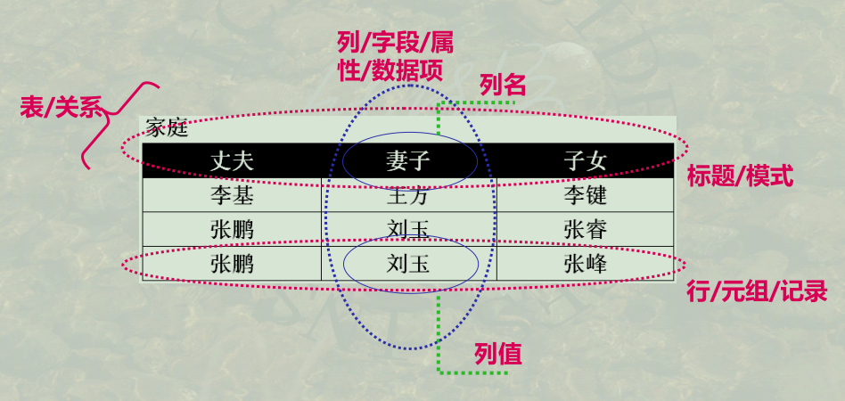

>  域:某一列的值域
>
> 候选码：可以唯一表征一行的某个属性或组合属性
>
> 主键：从候选码中选取一个作为主键，通常选单一列
>
> 外码：A的某一个列（非主键）是B表的主键（Key）

+ 关系运算         [内容跳转](#关系代数)

+ 完整性约束

  + 实体完整性：主键非空

  + 参照完整性：外键必须在B表中存在

  + 用户自定义完整性：常用于数据监控和清洗，如性别字段只能为男女，年龄字段必须为200内的整数等用户自定义的条件

    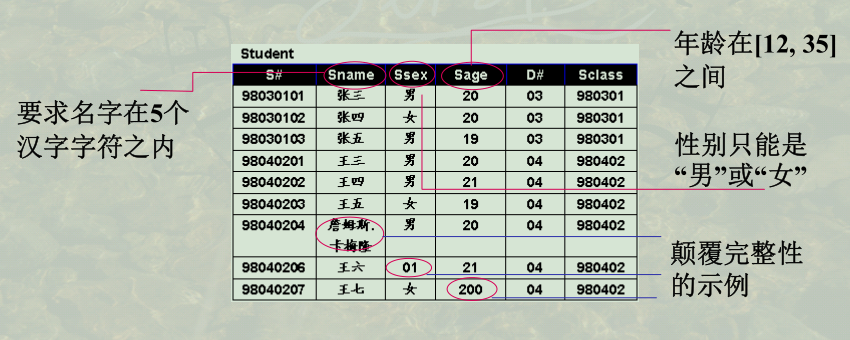

#### 关系代数

+ 并

前提：两个表的字段类型一致

+ 交
+ 差

以上三个概念同集合论中定义

+ 选择：选取行   where

+ 投影：选取列   select

+ 积：笛卡尔积    无连接条件

+ 连接

+ θ连接：有连接条件，等同于笛卡尔积后，选取R中属性A与S中属性B之间满足θ条件的元组

  + 等值连接：特殊的θ链接，θ条件是＝

+ 自然连接：特殊的等值连接，连接条件是表R和表S中具有相同名称的字段

+ 外连接

  + 左外连接  R left out join S on R.A=S.B

  R首先与S进行笛卡尔积等得到D，然后对于R中的每一行，通过R.A=S.B在D中筛选。对于某一行，可能在S中存在多行满足R.A=S.B，全部保留； R.A=S.B的条件在S中可能一行也不存在，这时R中的每一行都必须有一个结果，S为空

  + 右外连接 right out join
  + 全外连接 full out join

+ 除法

前提：R÷S的前提是，S的属性必须是R的真子集

具体演示：

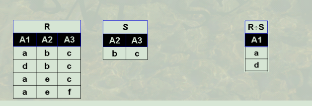

#### 关系演算

关系代数通过集合的形式进行关系运算，而关系演算则通过数理逻辑的方式进行关系运算，此处不详细研究

## 数据库语言SQL

SQL语言集DDL、DML、DCL于一体。大的来说，主要有以下9个关键词，每种都可以表达复杂的操作请求

+ DDL语言引导词：Create、Alter、Drop

  模式的定义和删除、包括定义DataBase、Table、View、Index、完整性约束条件等，也包括定义对象（RowType行对象、Type列对象）

+ DML语句引导词（增删查改）、Insert、Delete、Update、Select

+ DCL语句引导词：Grant、Revoke

  安全性控制：授权和取消授权

#### DDL

+ Create

```sql
Create database 数据库名

Create table 表名(列名 数据类型 [Primary key|Unique] [Not null]   列名 数据类型 )
Unique:是否候选码

Create view viewName as select 子查询

CREATE ASSERTION <assertion-name> CHECK <predicate>
```

+ Alter

```sql
alter table tablename
[add {colname datatype, …}] 增加新列
[drop { 完整性约束名}] 删除完整性约束
[modify {colname datatype, …}] 修改列定义
```

+ Drop

```sql
drop database 数据库名
drop table 表名
drop view viewName
```

Drop对应于Create，有Create就有相应的Drop

Drop删除的是表的结构，不同于delete

+ 切换/关闭数据库

```sql
use database
close database
```


**完整性约束**

> 这是所说的完整性约束包括实体完整性、参照完整性、用户自定义完整性的SQL实现

0. 基本概念

Integrity Constraint=（O，P，A，R）

​	O：数据集合：约束的对象？
​		列、多列(元组)、元组集合
​	P：谓词条件：什么样的约束？
​	A：触发条件：什么时候检查？
​	R：响应动作：不满足时怎么办？

基本分类

+ 静态约束
  + 列完整性—域完整性约束
  + 表完整性--关系完整性约束
+ 动态约束
  + 触发器

1. 静态约束

对象O是列或者表，谓词条件P是约束条件，触发条件A是数据库更新时，响应动作R为空

```sql
Create Table Course 
	( C# char(3) , Cname char(12), Chours integer,
	  Credit float(1) constraint ctcredit check (Credit >=0.0 and Credit<=5.0 ), 
      T# char(3) references Teacher(T#) on delete cascade 
     //以上是列完整性约束
     
      , primary key(C#)
      ,constraint ctcc check(Chours/Credit = 20) );
      //以上是表完整性约束
```

> 列完整性约束通过空格分隔，表完整性约束通过`,`分隔

+ 列完整性约束

```sql
{ NOT NULL |  //列值非空
    [ CONSTRAINT constraintname ] //为约束命名，便于以后撤消
        { UNIQUE  //列值是唯一
        | PRIMARY KEY  //列为主键
        | CHECK (search_cond) //列值满足条件,条件只能使用列当前值
        | REFERENCES tablename [(colname) ]
        	[ON DELETE { CASCADE | SET NULL } ] } }
```

+ 表完整性约束

```sql
[ CONSTRAINT constraintname ]  //为约束命名，便于以后撤消
    { UNIQUE (colname {, colname. . .})  //几列值组合在一起是唯一
    | PRIMARY KEY (colname {, colname. . .}) //几列联合为主键
    | CHECK (search_condition) //元组多列值共同满足条件
    //条件中只能使用同一元组的不同列当前值
    | FOREIGN KEY (colname {, colname. . .})
        REFERENCES tablename [(colname {, colname. . .})]
        [ON DELETE CASCADE] }
        //引用另一表tablename的若干列的值作为外键
```

> check 中的条件可以是Select-From-Where 内任何Where后的语句，包含子查询

+ Alter修改完整性约束

```sql
ALTER TABLE tblname
    [ADD ( { colname datatype [DEFAULT {default_const|NULL} ]
    [col_constr {col_constr...} ] | , table_constr }
    {, colname ...}) ]
    [DROP { COLUMN columnname | (columnname {, columnname…})}]
    [MODIFY ( columnname data-type
    [DEFAULT {default_const | NULL } ] [ [ NOT ] NULL ]
    {, columnname . . .})]
    [ADD CONSTRAINT constr_name]
    [DROP CONSTRAINT constr_name]
    [DROP PRIMARY KEY ] ;
```

+ 断言

```sql
CREATE ASSERTION <assertion-name> CHECK <predicate>
```

> 由于每次更新数据库都要检测所有断言，判断是否满足条件；因此，类似C 的`goto`，慎用断言！

2. 动态约束（触发器Trigger）

不同于静态约束，O、P、A、R均需要定义

```sql
CREATE TRIGGER trigger_name BEFORE | AFTER
    { INSERT | DELETE | UPDATE [OF colname {, colname...}] }
    ON tablename [REFERENCING corr_name_def {, corr_name_def...} ]
    [FOR EACH ROW | FOR EACH STATEMENT]
    //对更新操作的每一条结果(前者)，或整个更新操作完成(后者)
    [WHEN (search_condition)] //检查条件，如满足执行下述程序
        { statement //单行程序直接书写，多行程序要用下行方式
        | BEGIN ATOMIC statement; { statement;...} END }
```

触发对象：`[OF colname {, colname...}] } ON tablename`

触发时机：`BEFORE | AFTER    { INSERT | DELETE | UPDATE`

约束条件：`[WHEN (search_condition)]`

响应动作：`{ statement //单行程序直接书写，多行程序要用下行方式
        | BEGIN ATOMIC statement; { statement;...} END }`

对象别名：`[REFERENCING corr_name_def {, corr_name_def...} ]`

```sql
corr_name_def 的定义
{ OLD [ROW] [AS] old_row_corr_name //更新前的旧元组命别名为
| NEW [ROW] [AS] new_row_corr_name //更新后的新元组命别名为
| OLD TABLE [AS] old_table_corr_name //更新前的旧Table命别名为
| NEW TABLE [AS] new_table_corr_name //更新后的新Table命别名为
}
```

**典型应用场景：**

+ 设计一个触发器当进行Teacher表更新元组时, 使其工资只能升不能降

```sq
create trigger teacher_chgsal before update of salary
    on teacher
    referencing new x, old y
    for each row when (x.salary < y.salary)
    begin
        raise_application_error(-20003, 'invalid salary on update');
        //此条语句为Oracle的错误处理函数
    end;
```

触发对象：`teacher`表的`salary`字段

触发时机：`before update`

约束条件：`(x.salary < y.salary)`即更新的salary值小于原始的值

响应动作：提示错误

+ 假设student(S#, Sname, SumCourse), 当删除某一同学S#时，该同学的所有选课也都要删除。

```sql
create trigger delS# after delete on Student
    referencing old oldi
    for each row
    begin
    	delete sc where S# = :oldi.S# ;
    end;
```

触发对象：`Student`表

触发时机：`after delete`

约束条件：无

响应动作：删除`student`某一行后，与之相关的`sc`表的相应多行数据也要删除。

> 背景：某个学生退学后，他的所有课程成绩也要删除

+ 假设Dept(D#, Dname, Dean), 而Dean一定是该系教师Teacher(T#,Tname, D#, Salary)中工资最高的教师。

```sql
create trigger upddean before update of Dean on Dept
    referencing old oldi, new newi
    for each row when ( dean not in
        (select Tname from Teacher where D# = :newi.D#
        and salary >=
        all (select salary from Teacher where D# = :newi.D#))
    begin
    	raise_application_error(-20003, 'invalid Dean on update');
    end;
```

触发对象：`Dept`表的`Dean`字段

触发时机：`before update`

约束条件：`Dept`表某一行的`D#`不是该系教师的最高工资

响应动作：提示警告


> :star2: 触发器是一种动态完整性约束，另外一种等效的实现方式是数据库应用程序使用SQL多条语句实现，需要程序员自己操纵，更新多个表。如案例2中，删除`Student`表的某条记录后，可以通过多条SQL语句更新`SC`表等其他表，也可以实现和触发器同样的功能。

#### DML

0. Insert

+ 插入单条记录

```sq
insert into 表名 [ ( 列名 [,  列名 ]… ]
       values (值 [,  值] , …) ;
```

> values 后面值的排列，须与into 子句后面的列名排列一致
> 若表名后的所有列名省略， 则values后的值的排列，须与该表存储中的列名排列一致

+ 插入多条记录

```sql
insert into 名 表名 [( 列名[ ，列名]…)]
select子查询 
```

1. Delete


2. Update


3. Select

```sql
//简例
select distinc a.*,b.col1,b.col2 
from a left out join b
on a.col=b.co1
where 
group by
having 
order by
asc/desc
```


```sql
SELECT [ALL|DISTINCT|DISTINCTROW|TOP]
{*|talbe.*|[table.]field1[AS alias1][,[table.]field2[AS alias2][,…]]}
[case when]
FROM tableName
[WHERE…]
[GROUP BY…]
[HAVING…]
[ORDER BY…]
[LIMIT]
```

:star2: 顺序：先where筛选（行），然后根据groupby分组，（此处进行select筛选列），再通过having**筛选分组（组）**，order by排序，limit限制输出行数

+ 模糊查询

```mysql
//检索所有姓张的学生学号及姓名
Select S#, Sname From Student
Where Sname Like ‘ 张%’ ;

//检索名字为张某某的所有同学姓名
Select Sname From Student
Where Sname Like ‘ 张_ _’;

//检索名字不姓张的所有同学姓名
Select Sname From Student
Where Sname Not Like ‘ 张%’;
```

+ 多表联合查询

```myq
select a.col1,b.*
from a,b//此处逗号分隔相当于笛卡尔积
```

+ 子查询

  + in/not in
  + θsome/θall

  常用于查询最大最小值

  ```sql
  典型案例：查询最低工资的教师姓名
  Select Tname From Teacher
  Where Salary <= all ( Select Salary From Teacher );
  ```

  + exist/not exist

+ 并- 交- 差

  + 并 Union/Union ALL
  + 交 Intersect/Intersect ALL
  + 差 Except/Except ALL

  > 上述三个命令，不带ALL自动删除重复元组。如果需要保留重复元组需要使用ALL，假设子查询1的一个元组出现m次，子查询2的一个元组出现n次，则该元组在：
  >
  > + 子查询1 Union ALL 子查询2  ，出现m + n次
  > + 子查询1 Intersect ALL 子查询2  ，出现min(m,n)次 
  > + 子查询1 Except ALL 子查询2  ，出现max(0, m – n)次

#### DCL—数据库安全

**自主安全性机制**：存取控制(AccessControl)
	通过权限在用户之间的传递，使用户自主管理数据库安全性
**强制安全性机制**：
通过对数据和用户强制分类，使得不同类别用户能够访问不同类别的数据

0. 自主安全性机制

> 自主安全性是通过授权机制来实现的
>
> 户在使用数据库前必须由DBA 处获得一个账户，并由DBA授予该账户一定的权限，该账户的用户依据其所拥有的权限对数据库进行操作授予该账户一定的权限，该账户的用户依据其所拥有的权限对数据库进行操作; 同时，该帐户用户也可将其所拥有的权利转授给其他的用户同时，该帐户用户也可将其所拥有的权利转授给其他的用户( 账户)，由此实现权限在用户之间的传播和控制。

**基本思路**

AccessRule ::= ( S, O, t, P)

S:  请求主体( 用户)——用户多时，可以按用户组建立访问规则

O: 访问对象——访问对象可大可小(目标粒度Object granularity):属性/字段、记录/元组、关系、数据库

t: 访问权利——包括创建、增、删、改、查等

P:  谓词——拥有权利需满足的条件


**自主安全性的实现方式**

+ 存储矩阵

+ 视图

  根据需求定义不同用户级别可以看到的视图，再利用`Grant`命令将视图赋值给用户

**Grant**

```sql
GRANT {all PRIVILEGES | privilege {,privilege…}}
ON [TABLE] tablename | viewname
TO {public | user-id {, user-id…}}
[WITH GRANT OPTION];
```

> Grant命令粒度比较大，用于表名和视图

**Revoke——撤销授权**

```sql
REVOKE {all privilEges | priv {, priv…} } ON tablename | viewname
FROM {public | user {, user…} };
```

> A-->B-->C，当B撤销授权时，C也同时撤销

1. 强制安全性机制

暂未学习

#### 视图

```sql
create view view_name [( 列名[ ，列名] …)]
as 询 子查询 [with check option]
```

​		不像base table，视图是一个想象的表，实际物理存储中并不存在。当需要使用某个视图时，才执行视图生成命令。视图生成之后，可以和普通表一样的访问方式。一般视图仅用于select，是使用更新命令（增删改）。

#### SQL Server

SQL Server 的系统数据库

+ Master ： 是SQL Server中最重要的系统数据库，存储中最重要的系统数据库，存储SQL Server 中的元数据。
+ Model： 模板数据库，在创建新的数据库时，SQL Server将会复制此数据库作为新数据库的基础
+ Msdb： 代理服务数据库，提供一个存储空间。
+ Tempdb： 临时数据库，为所有的临时表、临时存储过程及其他临时操作提供存储空间，断开连接时，临时表与存储过程自动被删除。

> Master数据库是存储表结构的数据库

#### 数据字典

数据字典就是数据库的元数据，存储表的结构信息，是数据的数据

列的元数据信息如下图所示,通过下述`sql`语句可以查询`STUDENT`表的所有列信息

非常类似高级语言中的**反射**功能，提供一组API对数据结构信息进行访问

```sql
Select Column_Name From ALL_TAB_Columns
Where Table_Name = ‘STUDENT’ ;
```

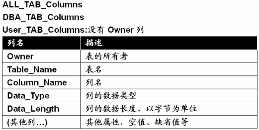

#### 嵌入式SQL&ODBC&JDBC

+ 几个基本问题

在高级语言中嵌入SQL，存在以下几个基本问题

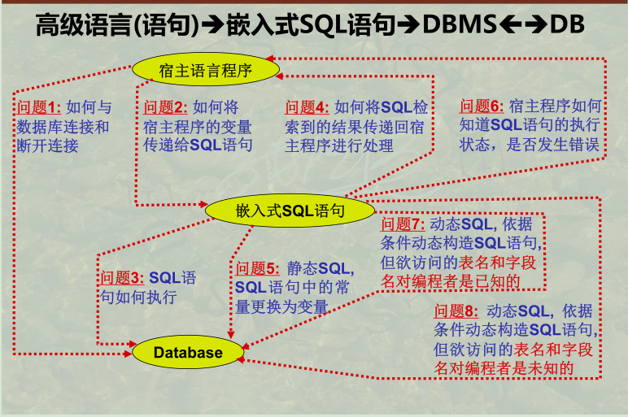

+ ODBC/JDBC

ODBC供C,C++, C#, Visual Basic, Power Builder调用数据库

JDBC供Java调用数据库

ODBC/JDBC隔离应用程序和DBMS之间的交互，在中间插入ODBC/JDBC层，可以实现对多种数据库，如Mysql、Oracle、DB2等多种数据库管理系统的交互。程序员主要调用ODBC/JDBC提供的API函数，不用直接与DBMS对接。

+ 框架的作用

程序员在实际开发中一般也不用直接操纵ODBC/JDBC，一般高级语言框架实现对数据库的简单高效访问。例如Java 的Spring框架在ODBC/JDBC的基础上进一步封装函数，Go语言的Gin框架等。程序员在真正实现的时候其实是比较简单的，框架已经把大部分的工作做好了。

使用框架开发应用程序，需要注意以下几个问题：

+ 宿主语言和SQL同一列数据类型的差异
+ `where`中多个条件的`And`连接符问题，自己拼接字符串有这个问题，框架应该都做好了
+ 宿主语言向SQL数据注入的方式

```sql
select XXX
from XXX
where name=XXX and id=XXX
```

`XXX`都是可以用Java变量注入的，需要注意传入的书写方式

+ 高级语言如何处理数据库事务机制——`commit`与`rollback`
+ 自己拼接字符串引发的SQL注入漏洞

## 数据建模与数据库设计


## 数据库管理系统的实现技术

+ Database System Implementation ,2ndEdition,机械工业出版社，2010

### 物理存储

存储单位：bit、Byte、KB、MB、GB、TB、PB、EB、ZB、YB、BB

内存页（Page）=磁盘块（Block）

页面置换算法

**RAID技术**

+ 并行处理 :并行读取多个磁盘
  + 比特级拆分:一个字节被拆分成8个比特位,不同比特位存储于不同磁盘.、
  + 块级拆分: 一个文件由多个块组成，不同块存储于不同磁盘.
+ 可靠性 :奇偶校验与纠错
  + 扇区/块读写校验：对一个扇区/块读写做校验
  + 磁盘间读写校验: 多个磁盘间共同构成的信息读写做校验

### 索引技术

索引文件是一种辅助存储结构，**其存在与否不改变存储表的物理存储结构**；然而其存在，可以明显提高存储表的访问速度。

+ 有索引时，更新操作必须同步更新索引文件和主文件
+ 索引文件比主文件小很多。通过检索一个小的索引文件(可全部装载进内存)，快速定位后，再有针对性的读取非常大的主文件中的有关记录

**SQL**

```sql
CREATE [unique] INDEX indexname
    ON tablename ( colname [asc | desc]
    {, colname [asc | desc] . . .} );
    
DROP INDEX indexname;
```

**索引分类**

+ 稠密索引 与 稀疏索引
+ 主索引与辅助索引
+ 聚簇索引
+ 倒排索引

#### B+树基础知识

**B+树的基本性质**（m阶的B树）

+ 叶子节点才是真正存储数据的地方，非叶结点仅具有**索引**作用，跟**记录有关的信息均存放在叶结点**中。
+ 叶子节点有序链表：树的所有叶结点构成一个**有序链表**，可以按照关键码排序的次序遍历全部记录
+ 根结点至少有两个子女
+ 每个中间节点都至少包含`ceil(m / 2)`个孩子，最多有m个孩子。中间节点不包含真实的数据指针
+ 每一个叶子节点都包含k-1个元素，其中 m/2 <= k <= m。
+ 所有的叶子结点都位于同一层

```C++
struct RealNode;//数据库中的一条记录Record
struct DataNode{
    int key;//索引Key
    RealNode *value;//指向真实数据的指针
};//真实数据

struct TreeNode{
    vector<DataNode> value;//当前节点的所有数据
    vector<TreeNode *> son;//儿子数组
    TreeNode *next;//叶子	`	节点特有的链表结构
}
```

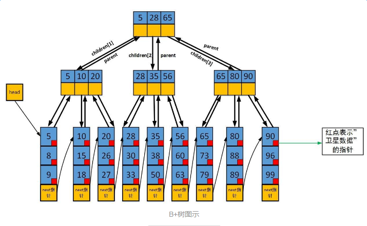

[B+树基本操作](https://www.jianshu.com/p/71700a464e97)

+ 建树（插入）
+ 查找
+ 删除

**B+树的优点**

比起B树，B+树 ①IO次数更少 ②查询性能很稳定  ③范围查询更简便

> 1. B+树中间节点没有Data数据，所以同样大小的磁盘页可以容纳更多的节点元素。所以数据量相同的情况下，B+树比B树更加“矮胖“，因此使用的IO查询次数更少。
> 2. B即Balance的缩写，是一棵平衡多叉树
>
> 3. 区间查询类似线段树的操作，更加方便.所有叶子节点形成有序链表，便于范围查询

#### **B+树在数据库中应用**

**基本特征**

+ **非叶结点**指针指向**索引块**，**叶结点**指针指向主文件的**数据块**或**数据记录**
+ 指向主文件的指针仅出现于叶结点（真实存储数据）
+ 所有叶结点即可覆盖所有键值的索引
+ 索引字段值在叶结点中是按**顺序排列**的

**具体实施方式**（数据库的什么部分是B+树的Key）

+ 用B+树建立键属性稠密索引

  ​		**索引字段是主文件的主键**，索引是稠密的。指针指向的是记录。表的存储方式(主文件)可以按主键排序，也可以不按主键排序

+ 用B+树建立稀疏索引(或主索引)

  ​		索引字段是主文件的主键，索引是稀疏的。主文件必须按主键排序。指针指向的是**数据块**,一个数据块中可能存在多条数据

+ 用B+树建立非键属性稠密索引

  ​		采用表的非主键字段作为B+树的Key，由于非主键字段可能存在重复，但是索引文件的索引字段是无重复的。主文件按非键属性排序。指针指向的是记录。

  > 该方法类似**前向星存图**的过程，主文件按照某个字段排序，然后记录每个字段的起始位置

  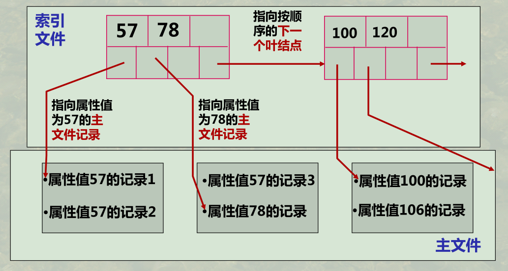

+ 用B+树建立非键属性稠密索引

  索引字段是主文件的非键属性。主文件不按此非键属性排序。索引文件的索引字段值是有重复的。指针指向的是记录。

**B+树 vs B树**

**B树**

+ 索引字段值仅出现一次或者在叶结点或者在非叶结点；
+ 指向主文件的指针出现于叶结点或非叶结点；
+ 所有结点才能覆盖所有键值的索引

#### 散列索引

+ 静态散列索引：桶的数目M是固定值

+ 动态散列索引：桶的数目随键值增多，动态增加
  + 可扩展散列索引
  + 线性散列索引

**可扩展散列索引**——桶的数量每次翻倍

参数k——i可能的最大的值， 可能的最大桶的数目为 2^k ，逐渐被使用

参数i——i 为散列函数当前已经使用到的最多位数

参数n=2^i ——当前桶数

**实现方案**

+ 散列函数h(k)是**k的二进制的前i位**，放入到对应桶中
+ 如果当前桶放不下，此处存在两种情况；
  + 如当前桶已经是最细粒度的桶，那么对全局的i++，增加桶的数量。把当前桶分裂成两个桶，对应的数据分到两个桶中；其他的桶也分裂成两个桶，但是指向同一个数据块
  + 如果当前桶不是最细粒度的桶，那么将当前的桶进行分裂即可，空间×2，其他桶不需要进行操作。

>  并非每个桶都有一个数据块；如果某些桶中的所有记录可以放在一个块中，则这些桶可能共享一个块。

**缺点**

+ 当桶数组需要翻倍时，要做大量的工作(当i很大时)；

+ 当桶数翻倍后，其在主存中可能就装不下了，或者要占用更大的空间
+ 如果每块的记录数很少，那么很有可能某一块的分裂比在逻辑上需要的分裂时间提前很多

**线性散列索引**——桶的数量每次+1

**实现方案**

+ 散列函数h(k)是**k的二进制的后i位**，放入到对应桶中（如果h(k)桶不存在另外处理）

+ 桶数n的选择总是使存储块的平均记录数保持与存储块所能容纳的记录总数成一个固定的比例，例如80%。超过此比例，则桶数增长1块，分裂
+ 分裂规则：0-->00,10    1-->01,11    00-->000,1000

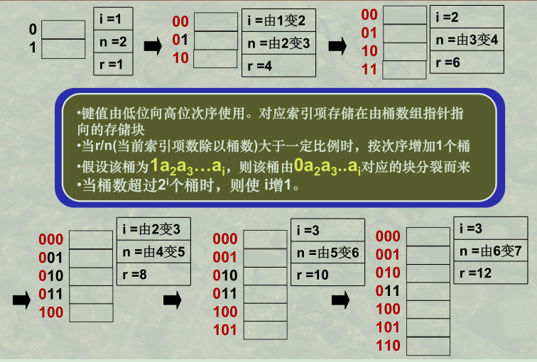

### 查询实现算法

> ​		将SQL语句首先编译成基础的关系运算，如交并补、选择、投影等，这个过程可以调整顺序从而实现SQL查询优化。然后进入物理查询优化：同一个“连接”操作可能由于存储方法、索引方法等的不同，在底层通过不同的物理存储实现（**同一关系操作的不同物理例行程序**）。物理优化主要解决内存和磁盘的交互问题，尽量减小磁盘I/O的次数，提高内存查询的效率。

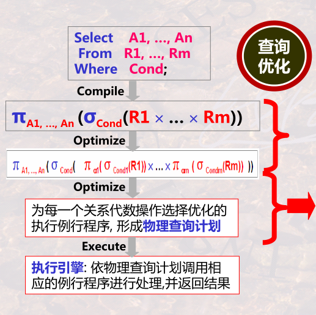

**数据库的三大类操作**

+ 一次单一元组的一元操作：选择、投影

通过迭代器算法实现

+ 整个关系（表）的一元操作：DISTINCT、Group by、sorting
+ 整个关系的二元操作：交并补、积、连接等

以上两者通过一趟扫描算法、两趟扫描算法、多趟扫描算法实现。底层具体通过排序技术、散列技术、索引技术实现


**连接操作的逻辑实现和物理实现**

> 逻辑实现比较简单，扫描R表的每一个记录，S表的每一个记录，如果R.A==S.A，那么表示两个记录可以连接
>
> 物理实现比较复杂，表的记录存储在硬盘上，以磁盘块为存储单位，每一个Block上存储多条记录。

+ Algorithm 1

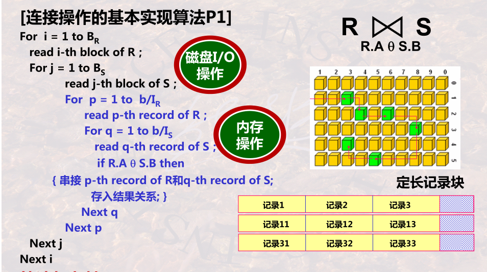

> 黑色的表示磁盘I/O操作，蓝色的表示内存操作，时间复杂度主要集中在磁盘操作

​	每次读取R表中的一个Block和S表的一个Block，然后扫描连接。

​	时间复杂度：B<sub>R</sub>+B<sub>R</sub>B<sub>S</sub>

​	空间复杂度：占用内存3b  (b是一个磁盘块大小)

+ Algorithm 2——全主存

> 前提：两个表都可以载入内存，把两个表的所有Block都载入内存

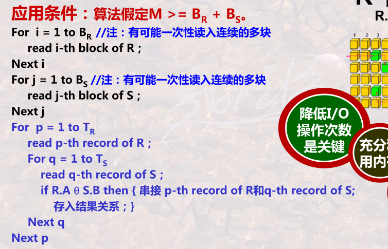

​	时间复杂度：B<sub>R</sub>+B<sub>S</sub>

+ Algorithm 3——半主存

> 前提：一个表可以放入内存，另外一个大表不行，类似大数据的Mapjoin

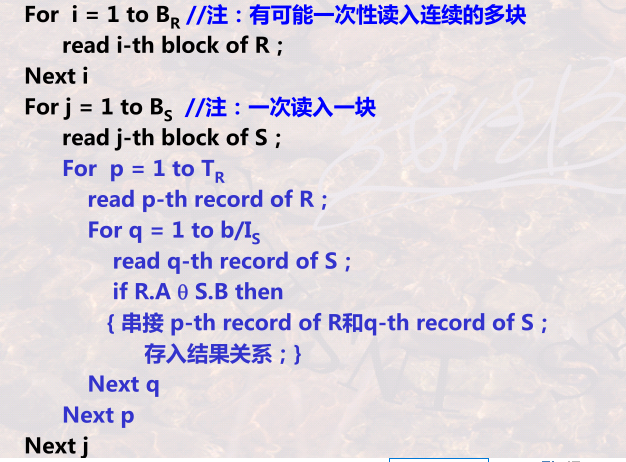

​	时间复杂度：B<sub>R</sub>+B<sub>S</sub>

+ Algorithm 4

> 两个表均无法放入内存，将R表每次选M-2个Block放入内存，S表每次选1个Block载入内存，还有一个Block用于存放最终结果。

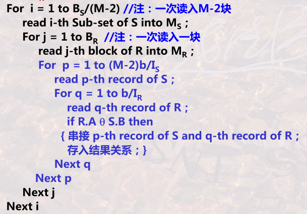

​	时间复杂度：B<sub>R</sub>B<sub>s</sub>/(M-2)+B<sub>S</sub>

+ Algorithm 5、

  对Algorithm4内存部分可以进行改进，通过建立Hash表对M-2个Block进行快速检索，而不是上述方法的简单扫描。


#### 迭代器方法——单一元组一元操作

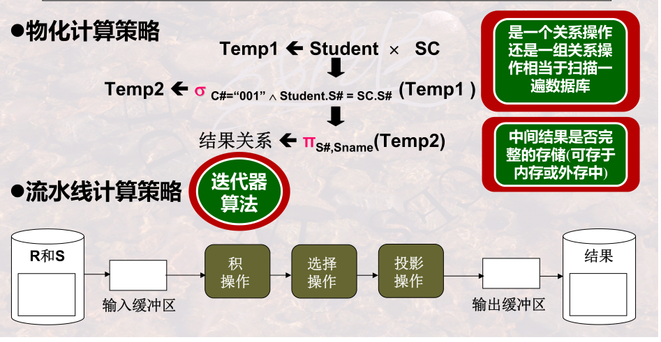

> 不同于`物化计算策略`，迭代器方法用于流水线计算策略，该方法不需要保存**中间结果**，连接操作的中间结果很可能引起维度爆炸

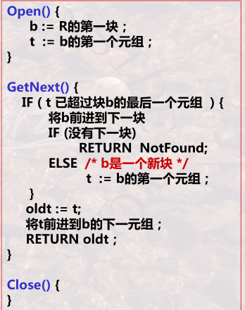

> 通过迭代器方法扫描表，本质上就是对磁盘Block进行封装，依次读取每个Block的每一条记录

#### 一趟扫描算法

​		本质就是通过排序、散列、B+树等建立一个可以快速检索的数据结构，然后从表格中每次读取一条记录就进行检索。前提是内存可以容得下该数据结构

**基于索引的算法——索引技术是如何加速查找的**

+ 基于索引的选择

+ 基于索引的连接——Zig-Zag连接算法

  双指针

#### 两趟扫描算法

> 本质就是多路归并排序

1. 基本原理

   问题：内存只有4GB，待排序文件100GB，如何排序？（外排序问题）

​		将100GB分成多个子集，每个子集2GB，刚好可以装入内存（此处最好让内存有其他空间）。将每个子集分别装入内存进行排序后输出到磁盘，此时磁盘中有50个已经排好序的大小为2GB的文件。

​		从每个子集文件（2GB）中读取一小段数据（size*50≈2GB）载入内存，使得总的大小小于内存大小。其实每次可以从每个子集中读取一个数据，但是这样会涉及到较多的I/O操作，降低效率；因此，每次应该尽量多的读取数据到内存。接下来的过程就是一个改进版的多路归并排序过程：50个排好序的序列进行多路归并，使用小根堆优化；当某一路数据结束的时候需要继续从磁盘中读取后边的数据。

2. Distinct

   第一趟：划分子表，并进行子表排序
   第二趟：归并阶段，在排序的基础上，直接将重复的记录剔出掉-不输出

   > 归并过程中，弹出最小值和上一次弹出来的最小值一样就删除

3. Groupby

   第一趟：划分子表，并进行子表排序
   第二趟：归并阶段，在排序基础上，将不重复的记录，作为新分组输出；重复的记录进行分组聚集计算。

   > 按照Groupby的键进行排序，归并过程同样的记录分组聚集

4. 交并补

   Union All直接将两个表叠加

   Union类似Distinc过程，需要去重复

5. join

   R和S分别按照连接键排序，这个地方我觉得可以用两个小根堆维护，相当于R和S分别整体有序的序列，然后使用双指针（Zig-Zag连接算法）

### 查询优化


#### 逻辑查询优化

​		SQL表达式通过编译，形成基本的关系代数表达式，但是此表达式一般不能直接执行，通常该表达式不是最优执行顺序，因此需要对关系表达式进行优化。逻辑查询优化主要的工作就是优化语法树，改变操作顺序。优化策略包括：`尽可能地早做选择和投影`、`把选择与投影串接起来`……

​		通过一些基本定理——关系代数操作次序交换的等价性，可以将SQL语句优化成最优的关系表达式

#### 物理查询优化

​		对于逻辑查询优化后得到的关系代数表达式，每一个基本操作，如“选择”，“投影”，“连接”等都有多种物理实现，大的方面包括迭代器方法、一趟扫描方法、两趟扫描方法，具体底层实现又可以分成排序方法、散列方法、索引方法。因此对于一个固定的关系代数表达式，通常存在多种物理实现的策略。对于每一种策略，需要评估该实现方法的代价。评估的方法就是利用数据字典，利用关系的元数据信息，如“表的记录数”、“Block数”、“不同属性的个数”等信息，评估每种方案的代价，最后选择一种最优的物理实现策略。确定方案之后，交给下层的计算引擎实现。


### 事务处理技术

> InnoDB，是MySQL的数据库引擎之一，现为MySQL的默认存储引擎

​		通常事务必须满足4个条件（ACID）：原子性（Atomicity，或称不可分割性）、一致性（Consistency）、隔离性（Isolation，又称独立性）、持久性（Durability）。

**1、A (Atomicity) 原子性**

原子性很容易理解，也就是说事务里的所有操作要么全部做完，要么都不做，事务成功的条件是事务里的所有操作都成功，只要有一个操作失败，整个事务就失败，需要回滚。

比如银行转账，从A账户转100元至B账户，分为两个步骤：1）从A账户取100元；2）存入100元至B账户。这两步要么一起完成，要么一起不完成，如果只完成第一步，第二步失败，钱会莫名其妙少了100元。

**2、C (Consistency) 一致性**

一致性也比较容易理解，也就是说数据库要一直处于一致的状态，事务的运行不会改变数据库原本的一致性约束。

例如现有完整性约束a+b=10，如果一个事务改变了a，那么必须得改变b，使得事务结束后依然满足a+b=10，否则事务失败。

**3、I (Isolation) 独立性**

所谓的独立性是指并发的事务之间不会互相影响，如果一个事务要访问的数据正在被另外一个事务修改，只要另外一个事务未提交，它所访问的数据就不受未提交事务的影响。

比如现在有个交易是从A账户转100元至B账户，在这个交易还未完成的情况下，如果此时B查询自己的账户，是看不到新增加的100元的。

**4、D (Durability) 持久性**

持久性是指一旦事务提交后，它所做的修改将会永久的保存在数据库上，即使出现宕机也不会丢失。


## 面试题

事务的基本要素

事务隔离级别

如何解决事务的并发问题(脏读，幻读)？

MVCC多版本并发控制？

binlog,redolog,undolog都是什么，起什么作用？

InnoDB的行锁/表锁？

myisam和innodb的区别，什么时候选择myisam？

为什么选择B+树作为索引结构？

索引B+树的叶子节点都可以存哪些东西？

查询在什么时候不走（预期中的）索引？

sql如何优化?

explain是如何解析sql的？

order by原理


## Reference

[哈尔滨工业大学数据库课程Mooc](https://www.icourse163.org/learn/HIT-1001516002?tid=1450161445#/learn/content)