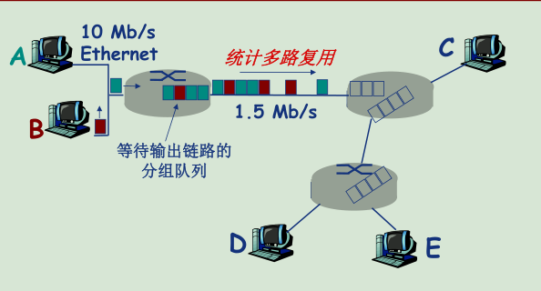
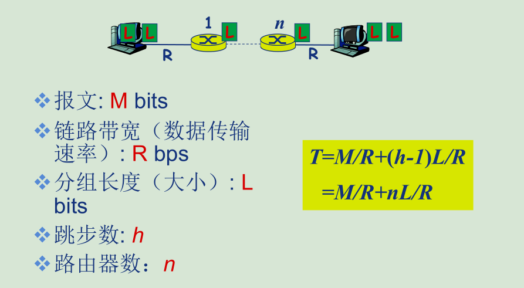

---

## 计算机网络概述

计算机网络=通信技术+计算机技术

<!--more-->

计算机协议：类比交通系统，仅有道路还不行，还需要各种交通规则(协议)，否则很容易出现拥堵或故障

协议三要素：

+ 语法Syntax
+ 语义Semantics
+ 时序

协议的官方文档：RFC: Request for Comments

---

网络由以下几部分组成：

+ 网络边缘
+ 接入网络，物理介质
+ 网络核心(互联的路由器)

网络边缘(端)的两种通信模型

+ client/server：web应用、FTP等
+ P2P(对等模型)：QQ、Skype等

接入网络的方式：

+ DSL/ADSL（家庭上网）

  利用已有的电话线路，数据通过电话线接入Internet，语音通过DSL电话线接入电话网

+ 电缆网络（家庭上网）

  和家用有线电视共用线路

+ 以太网（Ethernet）

  公司、高校、企业

+ 无线局域网Wifi

+ 移动蜂窝网

网络核心：路由（routing）+转发（forward）

> ​		计算机网络结构和道路系统很像,一级ISP相当于国道，在地图上用很粗的线表示，连接各个省份之间。二级ISP相当于省道，贯穿于各市。所有的端设备通过“小路”连入互联网，可以达到全世界任意的地方。

### 数据交换技术

0. 电路交换

电路交换主要用于电话系统，最典型的特征是独占资源，每条通话需要专门的数据链路

**电路交换的三个阶段：**

+ 建立连接（呼叫/电路建立）
+ 通信
+ 释放连接（拆除电路）

**电路交换网络的链路共享——多路复用技术**

>​		每路呼叫**独占**分配到的资源片进行通信,比如说电话系统，采用频分多路复用后，分配给某条线路的频段就是固定的，别人无法抢占。
>
>​		资源片可能“闲置”(idle)，如电话系统无人说话，但是此频段依然占据

+ 频分多路复用( frequencydivision multiplexing-FDM )

  频分多路复用的各用户占用不同的带宽资源，用户在分配到一定的频带后，在通信过程中自始至终都占用这个频带

+ 时分多路复用( time divisionmultiplexing-TDM )

  时分复用则是将时间划分为一段段等长的时分复用帧（TDM 帧），每个用户在每个 TDM 帧中占用固定序号的时隙。时分复用的所有用户是在不同的时间占用相同的频带宽度

+ 波分多路复用(Wavelengthdivision multiplexing-WDM)

  波分复用就是光的频分复用

+ 码分多路复用( Codedivision multiplexing-CDM )

  各用户使用相同频率载波，利用各自码片序列编码数据。传输过程输出的数据是各信号编码信号的叠加

  + 编码信号 = (原始数据) × (码片序列)

  + 解码 : 码片序列与编码信号的内积

  + 各用户码片序列相互正交(orthogonal)

1. 报文交换/分组交换

​        分组交换是一种特殊的报文交换，将报文拆分成一个一个很小的分组，加入“分组头”后进行传输。因此分组交换需要报文的拆分与重组

**统计多路复用**

​	如上图所示，多条道路既不复用频段，也不复用时段。对于某个路由器而言，他只负责**存储-转发**，报文中包含着目的地信息。

	+ 报文交换以完整报文进行“存储-转发”
	+ 分组交换以较小的分组进行“存储-转发”

**分组交换的报文交付时间**（仅考虑传输延迟）

> 总的传输时间T等于所有的报文M发送的时间，加上最后一个分组L经过n次路由的时间

2. 性能对比

分组交换vs报文交换

+ 降低数据链路传输时间，分组交换类似流水线，存在并行传输过程
+ 每个路由器的缓存容量要求小，L<<M

电路交换vs分组交换

+ 分组交换允许更多用户同时使用网络
+ 分组交换适用于突发数据传输网络（上网过程并不是一直在网络传输，用户的网络平均活动时间一般仅占10%，很多时间用户上网并不涉及到数据的上传和下载，而是在浏览下载好的页面）
+ 可能产生拥塞现象，造成分组延迟和丢失

### 专业术语

**丢包**：分组在路由器排队，分组到达速率超出输出链路容量时

**四种分组延迟**

+ 结点处理延迟（通常< msec，很多场景可忽略）

  + 差错检测

  + 确定输出链路

+ 排队延迟（很难界定）

  + 等待输出链路可用
  +  取决于路由器拥塞程度

+ 传输延迟（发送分组需要的时间）

  + L: 分组长度(bits)
  + R: 链路带宽 (bps)

  $$
  d_{trans}=L/R
  $$

+ 传播延迟（线路上消耗时间）

  + d: 物理链路长度
  +  s: 信号传播速度 (~2×10^8m/sec)

$$
d_{prop}=d/s
$$

**吞吐量/率**——Throughput

吞吐量 :表示在发送端与接收端之间传送数据速率 (b/s)

端到端路径的吞吐量取决于瓶颈链路的速率（最小链路）

### 计算机网络体系结构概览

网络体系结构是从**功能**上描述计算机网络结构

**分层结构的优点**

+ 结构清晰，有利于识别复杂系统的部件及其关系
  分层的参考模型（reference model ）

+  模块化的分层易于系统更新、维护

  任何一层服务实现的改变对于系统其它层都是透明的

+  有利于标准化

**分层结构的缺点**

分层过多可能会导致效率低下